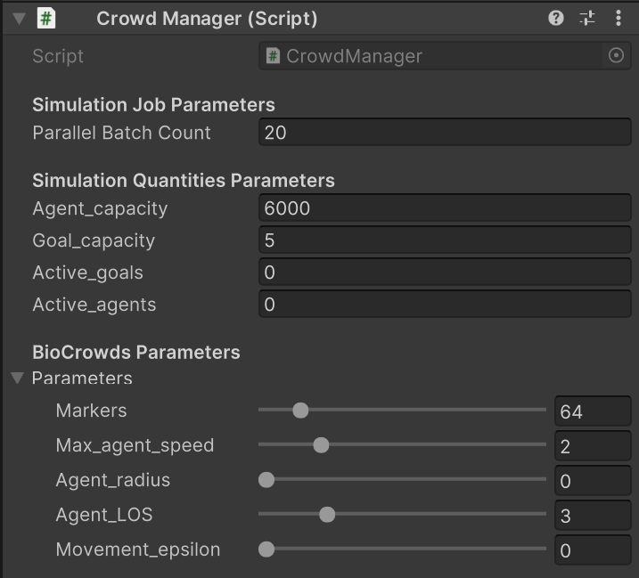
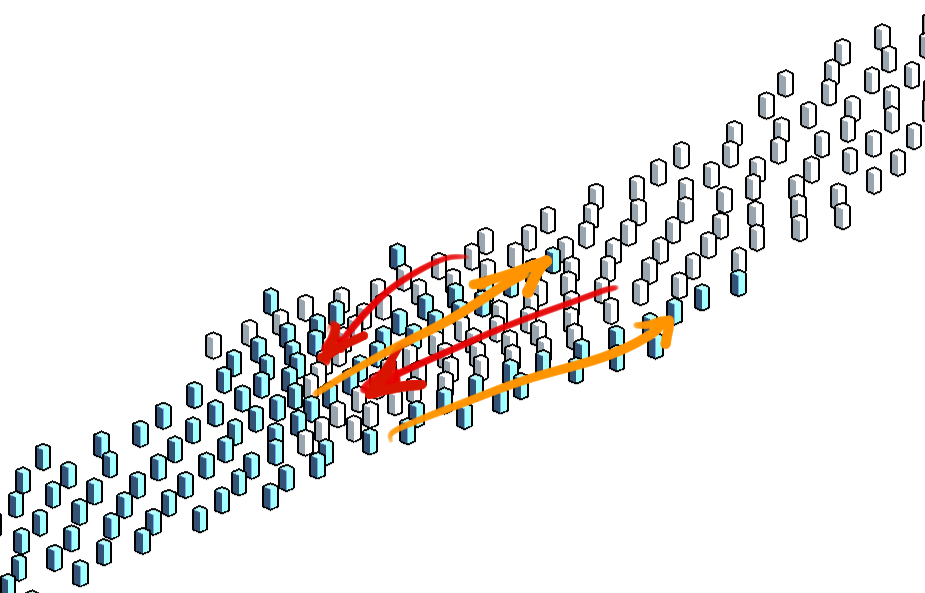

## biocrowds-techdemo

# Overview
This package implements a variation of the BioCrowds Crowd Simulation model in Unity3D using a Data Oriented Approach.
The original BioCrowds is built on the idea that the simulation world can be split into discrete parts, which agents can compete for.
These parts form a Voronoi partition of the space, and agents capture the cells closest to them, and move only inside those cells.
This avoids collsion.

Two implementation issues that occurs from that idea, and the original algorithm are: 
- the discretized world data can become huge;
- the distribution of space among the agents needs special care when parallellizing the algorithm.

The original BioCrowds[[1]](#references) further partition space in a regular square grid, each cell containing some quantity of 'space markers'. These space markers are sample in the simulation initialization. This fixes the world size to a pre-defined region (where there are markers).

In this implementation, I changed the algorithm slightly to favor the data oriented simulation flow.
Instead of pre-sampling a partition of space, I compute the samples on the fly, during the simulation.
To compute the agent step, we sample new markers for each cell (and their neighbors) containing at least an agent, and distribute them among those agents.
This process comes with two immediate advantages, there is no data to fetch to compute the agent step, and the world can be arbitrarily large (as long as you can index each position in space.)
    
The current implementation does not parallellize the marker sampling and distribution step, and this is currently one of the goals of this project.

All that said, this package heavily uses Unity Native Collections, Parallell Jobs and Burst Mathematics to increase performance of the simulation.


# Requirements and Installation
This package was tested in _Unity3D 2022.3.1f1(LTS)_ and requires:
- Unity Burst (tested with 1.8.4)
- Unity Collections (tested with 1.2.4)
- Unity Jobs
Then simply import the package.
 

## CrowdManager Component
A `CrowdManager` Component controls a BioCrowds simulation in a scene.
Simulations are completely separate to each other.

Simulation _meta parameters_ control performace and simulation objects capacities, they are configured in sections `Simulation Meta Parameters` and `Simulation Quantities Parameters`.

All simulation parameters can be configured in the section `BioCrowds Parameters` in the Unity Inspector.



## Simulation
You can initialize a simulation with the CrowdManager Component.

To run the simulation call the CrowdManager Component Methods.

Example:
     
```csharp
public CrowdManager crowdManager;

...

crowdManager.Init();

Vector3 position = Vector3.zero;
int leftGoalIndex = 0;
int rightGoalIndex = 1;

crowdManager.AddAgent(position, leftGoalIndex);
crowdManager.AddAgent(position, rightGoalIndex);

...

//Each call to Simulate computes one simulation step. Using a specific time delta.
crowdManager.Simulate(Time.deltaTime);

```
### Simulation Features

Lane formation
<p float="left">
    
    
</p>

4-Way Crossing


### Sample Examples
The package comes with an example scenes and components that implements some examples:
- `MouseControl` shows an example of using the mouse to control a crowd.
- `LaneFormation` models crowds forming lanes when interacting with each other.
- `4WayCrossing` shows the interaction of 4 crowds.

### Simulation Configuration Details
There is a relationship between the `Markers` setting, the quantity of space samples each cell of space will generate, and the `Agent Line of Sight` parameter, how far agents can look for available space and compete for it. If the `Agent_LoS` is too large in relation to a `Marker` quantity, the agent movement can be jerkier. I have not tested many different ratios, but between `32` and `64 markers/m²` results in smooth looking simulation.

The `Movement Epsilon` parameter controls the minimum length a computed movement vector needs to move an agent. Use this to finetune your simulation when agents become shaky when in tight groups, close to their objectives or at low speeds.

Currently `Agent Radius` is not implemented.


## Rendering
The package comes with two example Renderers for the simulation.
- The GPU instanced drawing `CrowdIndirectRenderer`
        (This uses a base mesh and `Graphics.DrawMeshInstancedIndirect` to draw agent meshes).
- The Unity `GameObject` based `CrowdObjectRenderer`
        ( It represents crowds by positions `GameObjects` according to the simulation.)

The example scene `Debug_Scene` shows both of those working solutions.

- As a third option, if you have specific needs in mind. You can write your own _Crowd Renderer_. This can be easily done by directly accessing the `CrowdManager` Component simulation data.

# References

- [[1]Bicho et al., Simulating crowds based on a space colonization algorithm, 2012](https://doi.org/10.1016/j.cag.2011.12.004)

# Backlog of Features
    - Parallellize the space distribution job.
    - Create a customizeable agent behavior system. (e.g. a 'script'-language)
    - Change the agent step data structure to a NativeArray instead of a NativeMultiHashMap to improve cache coherency.
    - Implement the Agent Radius feature.
